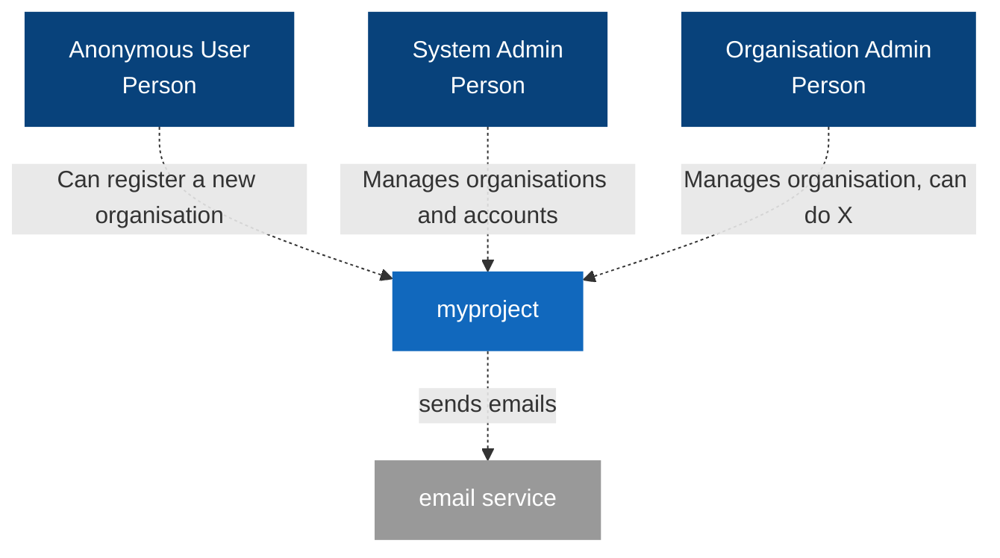

# Welcome to myproject

!!! todo

    This is the boilerplate documentation for myproject.
    Use it as a starting point to document the actual application.
    Feel free to remove and adds parts where needed.

## What is the purpose of the application?

!!! todo

    What is the application about? What are the target groups and main user stories?

## Architecture

!!! todo

    Describe the application architecture including connections to external services.
    Make sure to include all actual components of the application.

The application consists of different components.
The _frontend_ and the _admin UI_ are connected via a GraphQL API to a _backend_ implemented in Go.
The data is kept in a _PostgreSQL_ database. The _frontend_ is a React single-page application.

### System context diagram

!!! tip

    See [C4 model](https://c4model.com/#CoreDiagrams) for an introduction to the C4 architecture diagrams.

### Components

[Backend (Go)](development/backend.md)

:   Provides a GraphQL API for the frontend and admin UI. Data is stored in a PostgreSQL database.
Business logic and validation rules are defined in the backend.

[Frontend (React)](development/frontend.md)

:   The frontend is a single-page application based on React. It uses the GraphQL API for authentication
    and retrieving and manipulating data.

    <figure markdown>
      
      <figcaption>The frontend provides the public user interface</figcaption>
    </figure>

[Admin (React)](development/admin.md)

:   The admin UI is based on `react-admin` as a single page application (SPA) which accesses the GraphQL API of the backend.

    <figure markdown>
      
      <figcaption>Data of the application can be edited in the admin UI</figcaption>
    </figure>

## Development process

- All components of the application are versioned in a Git repository (as a monorepo).
- It uses GitLab CI for the build process to build and test the individual components and deploy the application.
- The result of a pipeline are Docker images for _frontend_, _admin_ and _backend_, which are deployed via Helm in Kubernetes.

## Deployment

The application is deployed in containers via Kubernetes. It can be run _stateless_ except for the database.

The GraphQL API is served in the _frontend_ and _admin_ containers using an Nginx web server as a reverse proxy.

A review and integration deployment is created in a _dev_ Kubernetes cluster.

### Production

!!! todo

    Describe the production deployment.

